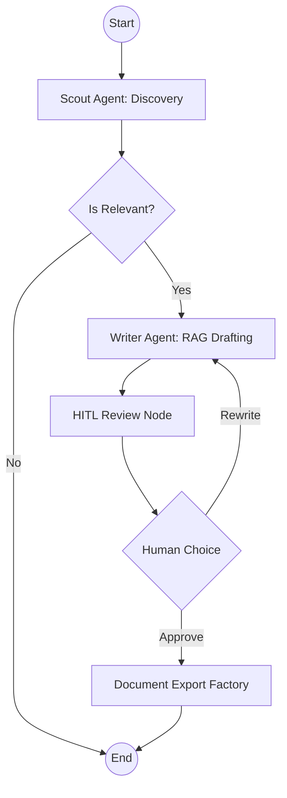

# SVdP Grant Hunter & Writer: Developer Entry Point

## 🏗️ Architecture Overview
The system utilizes a **Stateful Cyclic Graph (LangGraph)** to coordinate discovery, drafting, and human approval.



## 🚀 Quick Start Guide

### 1. Local Development (uv)
We use `uv` for lightning-fast dependency management.
```bash
# Install dependencies
uv sync

# Initialize local database (requires Postgres)
python initialize_db.py

# Run the UI
streamlit run app.py
```

### 2. Docker Cloud Deployment
The project is configured for **Railway** via the `Dockerfile`.
```bash
docker build -t svdp-grant-agent .
docker run -p 8080:8080 --env-file .env svdp-grant-agent
```

## 🏢 Agnostic Factories
To maintain vendor independence, the system abstracts core infrastructure:
- **`LLMFactory`**: Switch between OpenAI and Anthropic.
- **`DBFactory`**: Abstracts PGVector and standard SQL.
- **`ScraperFactory`**: Targeted discovery logic for local foundations.
- **`DocumentExportFactory`**: Professional PDF generation.

## 🔑 Environment Variables
| Variable | Description |
| :--- | :--- |
| `DATABASE_URL` | Postgres connection string (with vector extension). |
| `OPENAI_API_KEY` | Primary LLM provider key. |
| `LLM_PROVIDER` | `openai` or `anthropic`. |
